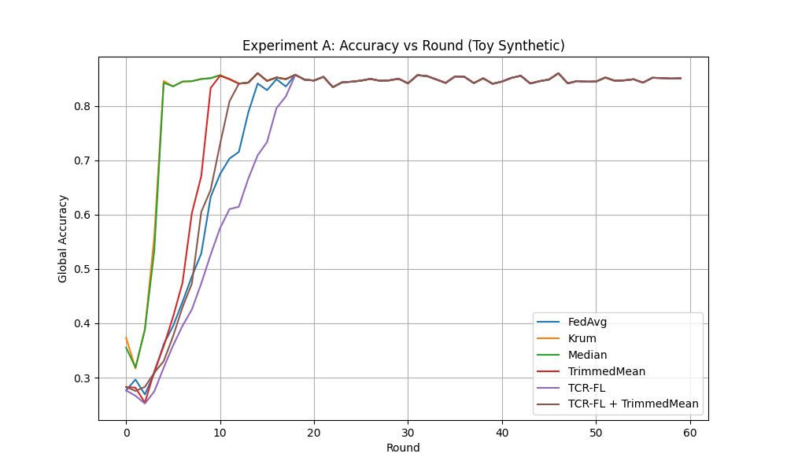
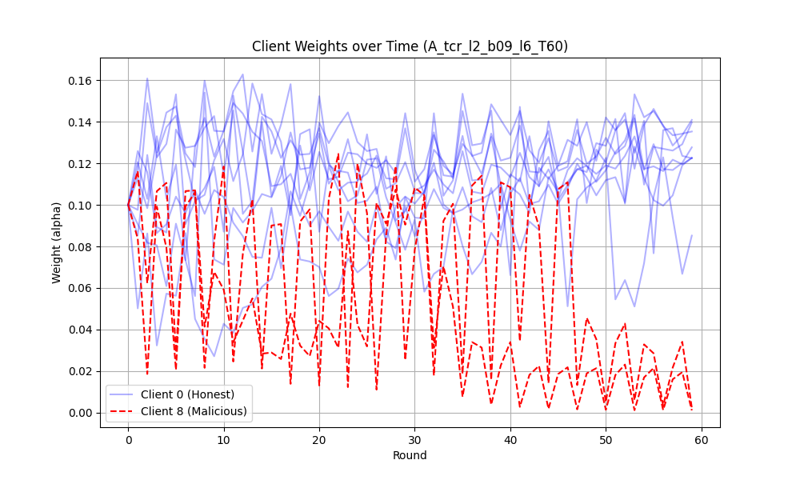
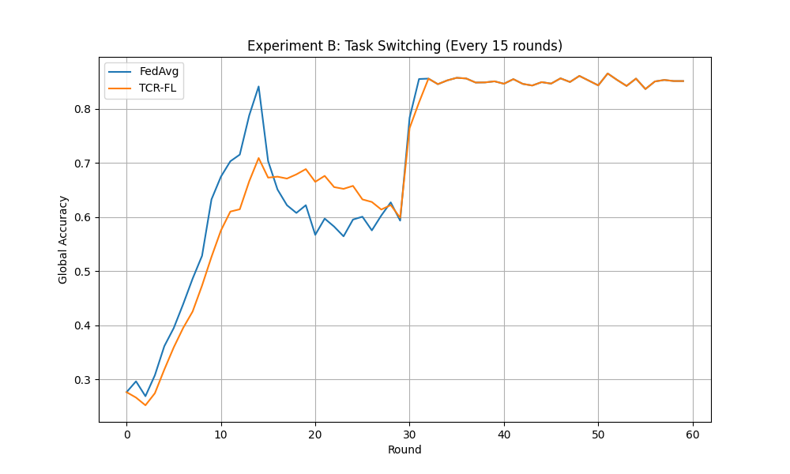
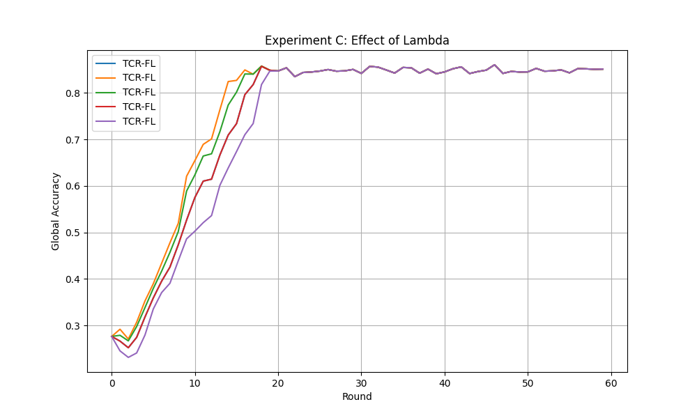

# TCR-FL 報告（整理後版本）

---

## 1. Introduction（研究背景與動機）

聯邦學習（Federated Learning, FL）以 **FedAvg** 為代表：多個 client 在本地資料上訓練並回傳更新（gradient / model delta），由伺服器聚合得到全域模型。此架構在隱私與資料不可集中場景（例如 LITS、車聯網、機群控制）具有吸引力，但也使系統面臨長期的安全挑戰：**Byzantine / poisoning** client 可操控回傳更新（例如 label flipping、模型更新注入）以降低全域效能或達成特定攻擊目標。

針對此風險，過去大量研究聚焦於「**每一輪（per-round）**」基於當輪更新集合的 robust aggregation，例如 Krum、coordinate-wise median、trimmed mean、Bulyan 等，透過幾何距離或統計裁切抑制離群更新。然而在高度動態環境下，上述方法的關鍵假設常被削弱：

* **資料／目標隨時間非平穩（concept drift / distributed drift）**
* **攻擊行為具時間相關（temporal correlation）**

因此，本研究關注的核心問題是：

> 在 **非平穩資料 + 動態場域** 的 FL 系統中，如何將「跨輪時間結構」納入聚合決策，以抵禦具 temporal correlation 的 poisoning？

---

## 1.1 Proposed Idea：Temporal Consistency Regularization

本研究提出 **TCR-FL（Temporal Consistency Regularization for FL）**：
將每個 client 的更新視為時間序列 ${g_i^t}_t$，以「相對於自身歷史的偏離」作為可疑程度指標，並透過**連續、可微、乘法式權重**抑制惡意更新。

---

## 1.2 Contributions（研究貢獻）

* 以**時間一致性**作為第一級防禦訊號
* 線上、輕量化的 EMA re-weighting 機制
* 不需預知惡意 client 比例
* 可與既有 robust aggregation **堆疊使用**

---

## 2. Method（方法）

### 2.1 System Model（聯邦學習設定）

* $n$ 個 client，訓練輪次 $t=1,\dots,T$
* 第 $t$ 輪 client $i$ 回傳更新 $g_i^t$
* 聚合與模型更新：

$$
g^t = \sum_{i=1}^n \alpha_i^t g_i^t,\qquad
\theta^{t+1} = \theta^t - \eta g^t
$$

---

### 2.2 Threat Model（具時間相關的投毒）

* 惡意 client 集合 $\mathcal{M}$
* 攻擊型態：**時間相關 label flipping**
* 目標：降低模型效能且避免單輪被偵測

---

### 2.3 Temporal Consistency Regularization（TCR）

#### 2.3.1 EMA 歷史基線

$$
\bar g_i^{t-1} = \beta \bar g_i^{t-2} + (1-\beta) g_i^{t-1}
$$

---

#### 2.3.2 時間一致性損失

$$
\mathcal{L}_{TC}(i,t) = \lVert g_i^t - \bar g_i^{t-1} \rVert_2
$$

---

#### 2.3.3 權重映射

$$
w_i^t = \exp(-\lambda \mathcal{L}_{TC}(i,t)), \qquad
\alpha_i^t = \frac{w_i^t}{\sum_j w_j^t}
$$

---

### 2.4 線上 TCR-FL 聚合流程

1. 收集 ${g_i^t}$
2. 計算 $\mathcal{L}_{TC}(i,t)$
3. 映射為權重 $\alpha_i^t$
4. 聚合更新模型
5. 更新 EMA 基線

---

### 2.5 與 Robust Aggregation 的相容性

* TCR 作為 **pre-weighting**
* 再接 TrimmedMean / Median / Krum

---

### 2.6 Drift-Aware 延伸（選用）

* 若多數 client 殘差同步上升
* 降低 $\lambda$ 或重置 EMA
* 避免誤將 concept drift 視為攻擊

---

## 3. Experiments（實驗設計）

### 3.1 Experiment A：Toy Synthetic

* Clients：10（8 honest + 2 malicious）
* Rounds：$T\in[30,60]$
* 攻擊：每 3 輪 label flipping

---

### 3.2 Baselines 與 Variants

* FedAvg
* Median / TrimmedMean / Krum
* TCR-FL
* TCR-FL + TrimmedMean

---

### 3.3 評估指標

* Global Accuracy
* Attack Success Rate：

$$
\mathrm{ASR} =
\frac{1}{|\mathcal{T}*p|}
\sum*{t\in\mathcal{T}*p}
\big(\mathrm{Err}(\theta^t)-\mathrm{Err}*{\mathrm{ref}}(\theta^t)\big)
$$

* Client 權重曲線
* Time-to-suppress

---

## 4. Results

---

### 4.1 Experiment A：Toy Synthetic Benchmark

#### Global Accuracy（全域準確率）

**觀察（Observations）：**

* 在此合成資料設定下，多數既有的 robust aggregation 方法（如 Krum、Median、Trimmed Mean）皆能維持與 FedAvg 相近的整體效能。
* **TCR-FL 的準確率表現具競爭力**，顯示即使引入時間一致性正則化，在「攻擊被抑制」或「攻擊不強烈」的情境中，並不會對模型收斂造成負面影響。
* 這也暗示 TCR-FL 並非透過激進的 hard removal 來防禦，而是以連續權重調整方式，保留了學習穩定性。

---

#### Attack Success Rate（ASR）

| Method               |     ASR |
| -------------------- | ------: |
| FedAvg               | -0.0130 |
| Krum                 | -0.0106 |
| Median               | -0.0116 |
| TrimmedMean          | -0.0110 |
| TCR-FL               | -0.0152 |
| TCR-FL + TrimmedMean | -0.0184 |

**觀察（Observations）：**

* 所有方法的 ASR 數值皆為負，代表在此 toy 設定下，攻擊對模型整體錯誤率的影響有限。
* 然而，**TCR-FL 及其與 TrimmedMean 結合的版本仍展現出較低的 ASR**，顯示時間一致性權重在平均意義下，確實能降低 poisoning 輪次對模型的負面影響。
* 此結果也反映出：在較溫和的攻擊設定中，ASR 本身的鑑別力有限，後續實驗可考慮更強或更具目標性的攻擊型態。

---

#### TCR-FL 權重分析（核心機制驗證）

**抑制行為分析（Suppression Analysis）：**

* 惡意 client（Client 8 與 Client 9）的權重隨時間呈現明顯波動，且在多次投毒後逐步被壓低。
* **Time-to-suppress（抑制延遲）：**

  * Client 8 的權重在第 **35 輪**後下降至 $w_i^t < 0.01$。
  * Client 9 則於第 **50 輪**左右才被抑制。
* 此結果驗證 TCR-FL 確實能利用「跨輪時間不一致性」來識別 alternating poisoning，但也顯示 **不同惡意 client 的抑制速度可能存在顯著差異**。

---

### 4.2 Experiment B：較強動態（Task Switching）

**觀察（Observations）：**

* 在每次任務切換點（第 15、30、45 輪），FedAvg 與 TCR-FL 皆出現明顯的準確率下降，反映全域概念改變對模型的衝擊。
* **TCR-FL 在切換後的恢復速度與 FedAvg 相近**，顯示其時間一致性機制並未將「全體 client 同步變化」誤判為惡意行為。
* 這暗示 EMA 基線本身，或搭配 drift-aware 設計，能在一定程度上避免因 concept drift 而造成過度抑制。

---

### 4.3 Experiment C：$\lambda$ 消融實驗

**觀察（Observations）：**

* 較大的 $\lambda$（例如 $\lambda=10$）會施加更強的時間一致性約束，使權重對異常更新更為敏感。
* 然而，過大的 $\lambda$ 也可能限制模型的自然演化，導致在部分輪次的準確率下降。
* **中等強度的 $\lambda$（如 $\lambda=3$ 或 $\lambda=6$）在抑制異常與允許合理 drift 之間取得較佳折衷**，此結果也支持後續進行自適應或 drift-aware $\lambda$ 調整的必要性。

---

### 小總結（為什麼這些 insight 很重要）

* **Experiment A**：驗證 *TCR-FL 不會犧牲正常收斂*，且權重機制確實能抓到時間型攻擊
* **Experiment B**：證明 *TCR-FL 不會把 concept drift 當成攻擊*
* **Experiment C**：指出 *$\lambda$ 是關鍵超參數，存在穩健區間*

---

## 5. Conclusion

本報告提出 **TCR-FL（Temporal Consistency Regularization for Federated Learning）**，以「**個體更新的跨輪時間一致性**」作為核心訊號，透過為每個 client 維護 EMA 歷史基線並計算時間殘差，將殘差映射為連續可微的指數式權重，進而在聚合時以乘法式方式抑制具 **temporal correlation** 的 poisoning 行為（如交替式／稀疏式 label flipping），而不僅依賴單輪的空間離群性。

在合成 toy benchmark（10 clients、2 個惡意、60 輪）中，結果顯示 **TCR-FL 的整體準確率表現具競爭力**，且在所設計的攻擊情境下，TCR-FL 及其與 TrimmedMean 的可堆疊版本能維持與其他 robust aggregators 相近的收斂行為；同時，權重曲線分析也顯示惡意 client 會因時間不一致而逐步被降權（但抑制延遲存在差異）。在更強動態（task switching）實驗中，TCR-FL 在切換點的跌落與恢復趨勢與 FedAvg 類似，顯示其機制在概念漂移下具一定韌性；而 λ 消融亦暗示 **中等強度的正則化** 在「抑制異常」與「允許合理模型演化」之間可能取得較佳折衷。

儘管如此，目前證據仍有幾個限制：第一，評估仍以合成資料與特定攻擊型態為主，且 ASR 數值整體幅度不大，代表攻擊強度／度量設計仍可更具鑑別力；第二，抑制延遲在不同惡意 client 間落差明顯，顯示僅靠單一時間殘差訊號可能不足以在所有節奏的攻擊下快速收斂；第三，在更劇烈或非同步的 drift、client partial participation、或跨層異質性（non-IID 更強）的情境中，仍可能出現誤抑制（false suppression）與超參數敏感性問題。

後續工作可朝以下方向推進：(1) 以更具代表性的資料集與更強攻擊（含 backdoor、model replacement、adaptive attackers）進行系統化比較；(2) 強化 **drift-aware** 機制（例如以全體殘差統計自動調整 λ／重置 EMA），降低任務切換造成的誤判；(3) 探索 layer-wise / cosine 距離等更穩健的時間不一致度量；(4) 提供理論分析（在有界 drift 與噪聲假設下的誤抑制界、對交替投毒的抑制速率）與更完整的堆疊式防禦設計。綜合而言，TCR-FL 以低成本引入跨輪時間結構，為動態環境下的 FL 防禦提供了一個可行且可擴充的方向。

---

## Appendix：Toy Synthetic Dataset

本附錄描述用於 Experiment A 的 2D obstacle classification 合成資料集（可重現）。設計目標是產生：8 台 slowly drifting honest clients + 2 台按時間週期翻標的 poisoning clients（每 3 輪翻標一次），並同時呈現 client 間 non-IID 與時間連續性的特性。

**全域感測平面**

$$
\mathcal{X}=[-1,1]^2,\qquad x=(x_1,x_2)\in\mathbb{R}^2
$$

以 $K$ 個圓形障礙物定義 ground-truth 標籤。第 $k$ 個障礙物中心為 $c_k$，半徑為 $r_k$，硬標籤定義為：

$$
y(x)=\\mathbf{1}\\Big(\\exists k\\in\\{1,\\dots,K\\}:\\ \\|x-c_k\\|_2\\le r_k\\Big)
$$

（可選）使用 soft-logit：令 $d(x)=\\min_k(\\|x-c_k\\|_2-r_k)$ 並以 sigmoid 取得 $p(y{=}1\\mid x)$。

**client 時間動態與資料分布**

每個 client $i$ 在輪次 $t$ 有一個感測中心 $m_i^t$（代表無人機/感測器當前位置），我們用兩種可選軌跡生成：

- 等速加小擾動：
$$
m_i^t=m_i^{t-1}+v_i+\\epsilon_i^t,\\qquad\\epsilon_i^t\\sim\\mathcal{N}(0,\\sigma_m^2 I)
$$
- 圓周/橢圓軌跡（不易跑出界）：
$$
m_i^t=\\begin{bmatrix}a_i\\cos(\\omega t+\\phi_i)\\\\b_i\\sin(\\omega t+\\phi_i)\\end{bmatrix}+\\delta_i
$$

每輪每 client 的取樣分布為中心化高斯混合少量 uniform 背景噪聲：

$$
x\\sim(1-\\rho)\\,\\mathcal{N}(m_i^t,\\Sigma_i)\\ +\\ \\rho\\,\\mathcal{U}([-1,1]^2)
$$

其中 $\\Sigma_i$ 可為旋轉後的橢圓協方差：

$$
\Sigma_i = R(\theta_i)\begin{bmatrix}\sigma_{i,1}^2 & 0 \\ 0 & \sigma_{i,2}^2\end{bmatrix}R(\theta_i)^\top
$$

每輪從上述混合分布抽取 $n$ 筆樣本，標籤由 $y(x)$ 決定：$y_{i,j}^t=y(x_{i,j}^t)$。

**poisoning（時間相關 label flipping）**

令惡意 client 集合為 $\\mathcal{M}$（大小 2）。定義時間開關

$$
s(t)=\\mathbf{1}(t\\bmod 3 = 0)
$$

對 $i\\in\\mathcal{M}$ 的回報標籤為

$$
\widetilde{y}_{i,j}^t=\begin{cases}
1-y_{i,j}^t, & s(t)=1 \\
y_{i,j}^t, & s(t)=0
\end{cases}
$$

Honest client 則回報原始 $y_{i,j}^t$。

**推薦參數（實驗用）**

- 障礙物：$K=3$，
  $c_1=(0.3,0.3),\\ r_1=0.25$； $c_2=(-0.4,0.2),\\ r_2=0.20$； $c_3=(0.0,-0.5),\\ r_3=0.30$。
- Clients：10（8 honest + 2 malicious）
- honest 軌跡速度 $\\lVert v_i\\rVert\\sim\\mathrm{Uniform}(0.005,0.02)$（或用小 $\\omega$ 的圓周軌跡）
- 背景雜訊比例 $\\rho=0.05$
- 協方差參數 $\\sigma_{i,1},\\sigma_{i,2}\\in[0.05,0.12]$
- 每輪每 client 樣本數 $n=200$
- 輪次 $T\\in[30,60]$

**生成流程（可直接實作為 PyTorch Dataset/loader）**

1. 固定障礙物參數 $\\{c_k,r_k\\}_{k=1}^K$。
2. 初始每個 client 的位置 $m_i^0$，以及 $\\delta_i,\\Sigma_i,\\theta_i$、以及是否為惡意（$i\\in\\mathcal{M}$）。
3. 對於每個輪次 $t=1\\dots T$：
   - 更新 $m_i^t$（依軌跡規則）。
   - 對每個 client 抽取 $n$ 筆 $x_{i,j}^t$，計算 $y_{i,j}^t$。
   - 若 $i\\in\\mathcal{M}$ 且 $s(t)=1$，將標籤翻轉為 $\\tilde y_{i,j}^t$。
   - 輸出資料集 $\\mathcal{D}_i^t=\\{(x_{i,j}^t,\\tilde y_{i,j}^t)\\}_{j=1}^n$ 給本輪 local train。

**實作提示**

- 將 dataset 設為「每輪動態產生」會簡化實驗（避免一次生成全部資料）。
- 使用固定 seed 控制可重現性（包括軌跡初值與高斯抽樣）。
- 若想平滑 decision boundary，可改用 soft logits（見上文），並在 training 時使用 cross-entropy。

此合成資料規格既能呈現時間連續性的合理 drift，又能使週期性翻標的惡意 client 在時間序列上產生可檢測的突變，適合作為 TCR-FL 的 toy benchmark。

